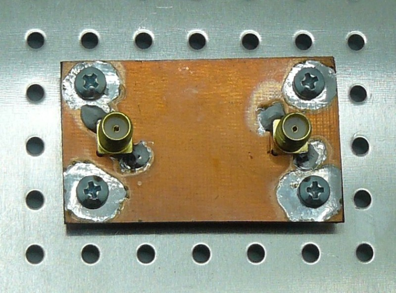
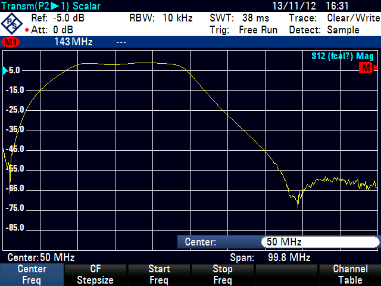

[Czech](./README.cs.md)

# BP01A - Radio frequency band pass filter

A simple RF filter prototyping test-bed. The filter is intended to be constructed from a standard 0805 size SMD components (Inductors, capacitors). 

## Features
  - LNA bias power pass trought
  - Standard 0805 sized SMD components
  - Multiple RF filter topologies supported

The example SMD construction of band pass filter intented to be used in radioastronomy applications. Primarily designed to 20-40MHz pass band.

